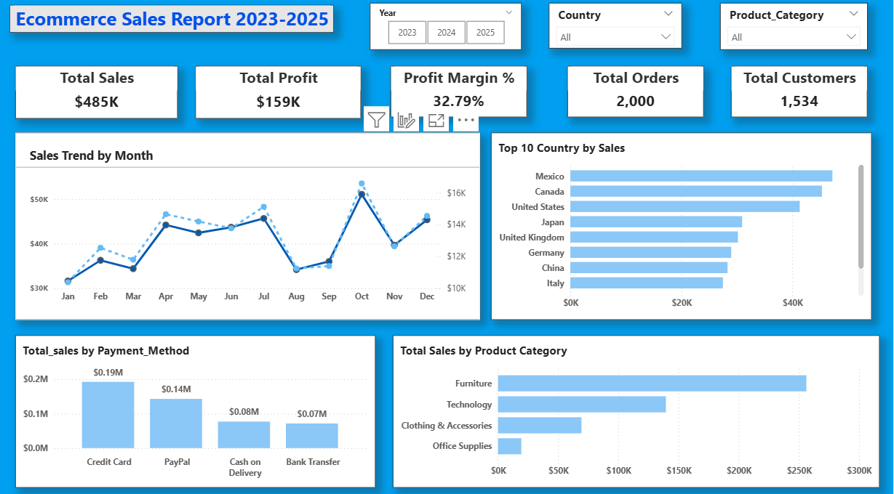

# 📊 Ecommerce Sales Dashboard

## 👋 About Project
This is my first Power BI project.

I created a dashboard to analyze:
- Sales
- Profit
- Customers
- Orders

## 📸 Dashboard Preview

## 📈 Key Metrics
- Total Sales: $485K
- Total Profit: $159K
- Profit Margin: 32.79%
- Total Orders: 2000
- Total Customers: 1534

## 💡 Insights
- Furniture has highest sales
- Credit card is most used payment method
- Europe generates high profit

## 🛠 Tools Used
- Power BI
- Excel
- DAX

## 👨‍💼 Author
Guhan
